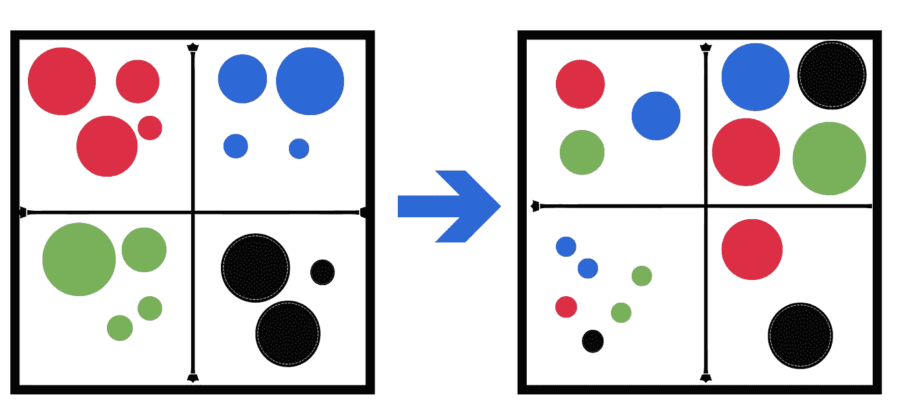
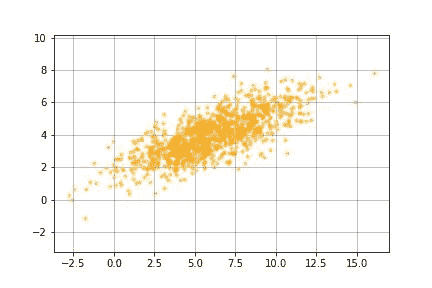
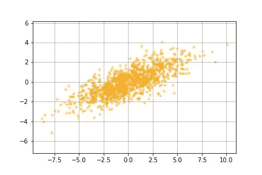
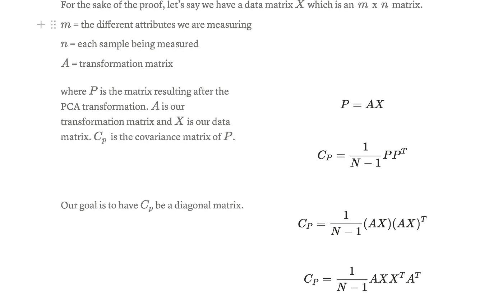
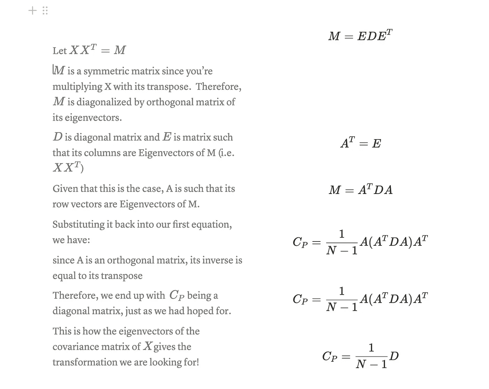
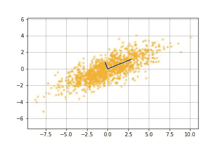
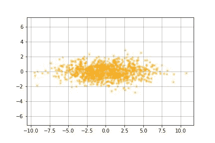
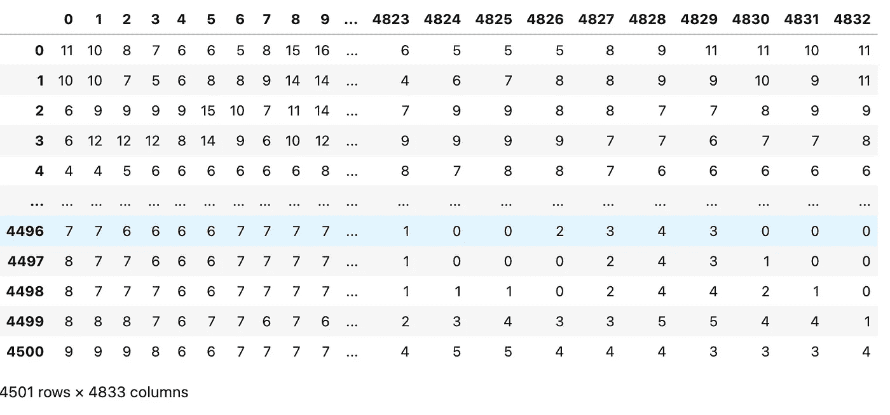
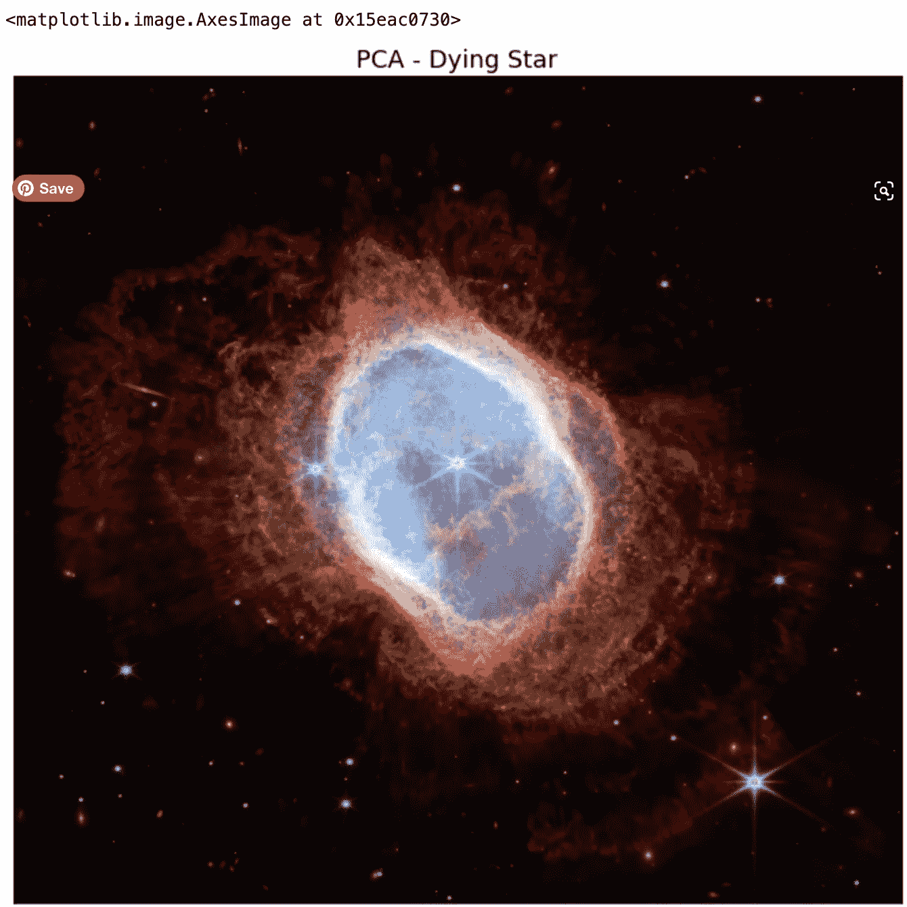

# 你忽略了 PCA 背后的重点

> 原文：<https://pub.towardsai.net/youre-missing-the-point-behind-pca-656982bdaa3b?source=collection_archive---------0----------------------->

就像计算机科学中的大多数事情一样，理解 PCA(主成分分析)是什么或者它为什么工作需要花费数小时来挖掘和筛选复杂的文档。当试图了解 PCA 时，我遇到的大多数资源都掩盖了 PCA 实际上是如何/为什么工作的，并且没有给我任何算法动机背后的直觉。

我写这篇文章的目的是编写一个简单易懂的关于 PCA 实际上是什么以及它为什么工作的描述。我将提供任何进一步研究的资源链接。

*你好！我叫南迪尼·李腾，是计算机专业的大三学生。这是我的 CS 博客，我试图用最不晦涩的方式记录我所学到的东西。如果你像我一样，喜欢深入挖掘以获得对事物的良好理解，但最终却花费数小时试图解密文档，那么你就在正确的地方。*

所有资源的链接都在文章底部！

在试图理解 PCA 背后的数学原理之前，您需要熟悉以下内容:

*   特征分解
*   线性转换

如果您从未听说过这些术语，那么在阅读本文之前，您应该先看看底部的参考资料。如果您对这些术语的含义有一点模糊的了解，那么您可以开始阅读本文，并在需要时重温这些主题！

# 主成分分析

尽管 PCA 通常被认为是一种降维技术，但这并不完全准确。

**如果说你从这篇文章中学到了什么，那应该是:PCA 只是数据的线性变换**——如果你愿意的话，是视角的改变。这个想法是通过改变查看数据的视角来更好地理解数据中的潜在模式。

[*但是到底什么是线性变换呢？*](https://www.youtube.com/playlist?list=PLZHQObOWTQDPD3MizzM2xVFitgF8hE_ab)

按颜色(左)、大小(右)排序的弹珠盒:变换到不同的坐标系

假设你的数据是一个彩色弹珠的大盒子，每种颜色都在它自己单独的盒子里。像这样查看您的数据(弹珠)有助于您理解某些事情，例如弹珠可用的颜色数量。但是，如果仅仅因为你选择用颜色来组织你的弹珠，你的弹珠中就缺少了其他的图案，那该怎么办呢？在这个盒子上应用 PCA 算法就像摇动盒子并根据弹珠的大小而不是颜色重新排序。在这样做的过程中，不同的模式(在本例中是一个与大小有关的模式)出现了。

当然，这是一个简单的类比，我们应该注意不要延伸其含义。这个想法是为了理解 PCA 是数据的线性变换技术——视角的改变。

因此，这种算法真正做的是通过不同的特征/特征集(维度或轴，在这里，我们将特征从颜色改为大小)对数据进行聚类或排序，以期更好地理解数据及其趋势。

PCA 的真正用例实际上在于它构建转换矩阵的方式——它挑选“特征”或“维度”来组织数据的方式。

PCA 实际上提出这组新维度的方式是通过**最大化数据中的“扩散”或方差。**这背后的直觉是:给定我们的数据集具有良好的测量(最小的噪声)，我们假设最大方差的方向捕获了我们数据中最有趣的模式/动态(信号)。因此，改变我们的参考框架— —我们的基础——使之与最大方差的方向一致，可以让我们更好地分析/研究数据中的这些模式。

处理海量数据集的另一个目标是最小化数据集中的冗余。例如:给定两个高度相关的特征，我们可以通过只记录其中一个特征而不是两个特征来减少冗余。这是因为我们总是可以使用两个特征之间的关系来产生第二个特征的数据。因为 PCA 也具有减少冗余的目标，这也内置于算法中。

PCA 将新轴/尺寸/特征从最“有用”到最“不有用”排序。这意味着我们可以轻松地丢弃不太有用的属性，从而更好地优化我们的学习算法。这种“去除属性”就是线性代数中所说的将数据投影到低维子空间。由于这些属性是“新”的，与我们数据的原始属性完全不同，我们可以减少数据的维度，而不必显式地“删除”任何原始属性。因为我们有转换矩阵，我们总是可以通过使用这个矩阵的逆矩阵来重新导出数据的原始排序。当我们在本文后面应用这个算法压缩一个垂死恒星的大图像时，这将变得更加清楚。这使得 PCA 成为数据科学中降维的流行选择。

PCA 算法的**有用性**基于**方差**。它将维度(主要成分)按照它们捕获的差异量进行排序。第一维——第一主成分——将沿着变化最大的数据的方向。第二主成分必须与第一主成分正交(垂直),并且在第二高方差的方向上。重复这一过程以找到其他主成分。我们将每个新的主分量限制为与所有之前的分量正交，因为这允许我们利用线性代数。

**使用 python 执行 PCA 有几种方法:**

*   **Sklearn 的分解模块**。这是执行 PCA 最直接的方法
*   从头开始:**使用协方差矩阵**和**特征分解**:理解算法背后数学的最佳方式
*   **奇异值分解**:另一个伟大的线性代数技术，允许我们跳过一些步骤！

我们将研究后两种方法，因为第一种方法被深入研究并且简单明了。

# 算法:

*   第一步是通过从数据中减去平均值来使数据围绕平均值。如果您的数据集有属性，每个属性都有很大的差异，但是如果属性的重要性与此差异无关，那么您应该将列中的每个观察值除以该列属性的标准偏差。
*   这是一个重要的考虑因素，因为我们正在最大化方差的方向。这意味着数据的一个属性的范围比其他属性大得多:例如，如果 salary 属性的范围是 0–100000，而其他属性的范围较小:0–10，那么 PCA 将关注于 salary，因为就它所知，salary 是方差最大的属性。但是如果你不希望 PCA 这样做，那么你就应该标准化你的数据集。

***此时，你的数据已经准备好可以和 Skearn 的分解模块和*** [***执行 PCA***](https://www.geeksforgeeks.org/implementing-pca-in-python-with-scikit-learn/) ***一起使用了。***

*   求数据的协方差矩阵。协方差矩阵是对数据中不同属性之间的关系进行“编码”的一种方式。它是一个矩阵，记录了每个可能的属性/维度对的协方差。本文稍后将对协方差矩阵进行更深入的探讨
*   求协方差矩阵的[特征向量](https://www.youtube.com/watch?v=PFDu9oVAE-g&t=466s)和特征值
*   得到的特征向量是我们的主分量
*   特征值给我们一个由特征向量——主成分——描述的方差量的指示
*   如果想要降低数据集的维数，请选择要保留的主成分数
*   将转换应用到居中的数据矩阵！

# 主成分分析矩阵:

PCA 矩阵:我们称我们的数据矩阵为 x。

*   数据矩阵的行对应于单个实验的测量值。
*   数据矩阵的列对应于被测量的每个特征。

如果我们的数据包含关于国家的信息:行对应于我们收集数据的不同国家，列对应于我们收集的每个国家的特征:名称、GDP、人口等等。

# 探险

我们准备用 python 来探索算法。我是用 Jupyter 笔记本做的。如果你想下载并跟随，我在底部有这个文件的链接！

让我们导入所有必需的库。

为了更好地理解到底发生了什么，我们将把该算法应用于一个小的虚拟数据集。这个数据集包含一千对坐标。

*   cov_mat:这个分布的协方差矩阵(协方差矩阵稍后解释)
*   平均值:分布的平均值
*   大小:要产生的数据点数

图 1:虚拟数据图

接下来，我们将通过从所有数据点中减去平均值来使数据以平均值为中心。这也使得使用线性代数技术更容易，因为线性代数就像是固定在原点的东西。

图 2:居中的数据图

现在，每个数据点都可以被视为从原点开始的向量。我们现在需要一种方法来编码一些测量“方差”的方法，这样我们就可以确定它(方差)最大化的向量。为此，我们使用协方差矩阵。

**整个算法的两个目标**:最大化方差(最大化来自我们数据的洞察力或信号)和最小化冗余，被编码在协方差矩阵中。为了理解这个算法，这个矩阵背后的直觉可以说是最重要的。

协方差衡量一对属性之间的线性关系程度。协方差值大表示线性关系强，协方差值小表示线性关系弱。这意味着高协方差值表示很大程度的冗余。

给定一个多维数据集，我们需要一种方法来跟踪每对特征之间的协方差。记住:协方差是我们如何编码冗余的概念，方差是我们如何在算法中编码信号强度。

**协方差矩阵**，C，包含我们数据集中每一对可能的属性/特征之间的协方差:对于这个具有两个特征(x，y)的数据集，协方差矩阵是 2X2，有四个条目。自然地，协方差矩阵中的对角线条目捕获每个特征/维度的方差。非对角线元素捕捉每个要素与其他每个要素的协方差。

x，y 作为特征的协方差矩阵

最大化信号(方差)和减少冗余(协方差)转化为最大化对角线条目(方差)和最小化非对角线条目。因此，我们理想的数据集应该有一个对角协方差矩阵！

因此，PCA 的目标是找到一个变换矩阵(A)来变换我们的(中心)数据矩阵(Z ),使得结果矩阵 Z_pca 具有对角协方差矩阵。

线性代数使得寻找这样的变换矩阵变得非常简单。原来我们 Z (均值居中数据)的协方差矩阵的**特征向量给了我们这样一个变换。**

下面是一个简短证明的图片:

*注:证明中定义矩阵的方式与实际执行 PCA 时的不同。PCA 文献定义数据矩阵的方式是将列作为被记录的特征，将行作为样本。*

特征向量给我们主成分的方向，而相应的特征值给我们每个主成分(特征向量)的‘有用性’。

因此，将特征向量按其相应特征值的降序排序将会给我们提供理想的变换矩阵。

[*什么是特征向量*](https://www.youtube.com/watch?v=PFDu9oVAE-g) *？*

显示特征向量/主成分的数据图

现在我们实际上把这个变换矩阵(把变换矩阵乘以我们的数据矩阵)应用到我们的数据上，以改变到新的、更有用的坐标系。

PCA 变换数据

现在我们完成了！！

我们看到数据现在相对于图像 ___ 中的特征向量(主成分)绘制。总结一下这一转变:

*   我们首先通过从数据中减去平均值来翻译数据
*   然后，我们将数据旋转一个角度，使主成分轴(特征向量)与默认的 x，y 轴对齐

# 主成分分析和奇异值分解之间的联系

执行 PCA 的另一种方法是利用它与奇异值分解(SVD)的联系。通过使用这种方法，我们可以跳过一些步骤！

如果您以前没有做过 SVD，请不要担心，您仍然可以继续做图像压缩部分。重要的是从上面理解协方差矩阵，这是帮助我们理解 PCA 工作背后的直觉的东西。

[*什么是奇异值分解？*](https://www.youtube.com/watch?v=EfZsEFhHcNM&t=1s)

这里的关键思想是协方差矩阵的特征向量可以通过 Z(我们的均值中心数据矩阵)的奇异值分解直接得到。

矩阵的奇异值分解将矩阵分解为:

v 是正交矩阵，其列是 *Z.T * Z* 的特征向量。

所以，**V 的列向量就是 *C* 的特征向量，我们的协方差矩阵！**

因此，V.T 的行给出了主分量！V.T 是我们的变换矩阵！

你可以用下面的代码证明这是真的！

由 1\sqrt(n-1)缩放的奇异值测量由每个主分量捕获的方差。

特征值是奇异值的平方。如前所述，特征值给出了由相应的特征向量(主分量)捕获的方差的意义。

为了确定主成分的数量 *K* 捕获多少方差的比率:

其中 s_i 为第 I 个奇异值，k 为保持的分量数，N 为主分量总数。

为了进一步探索这种方法，我们将压缩詹姆斯·韦伯太空望远镜的一幅图像。

请务必下载此图像，并将其保存在您当前的工作目录/文件夹中。

垂死的恒星图片——美国宇航局詹姆斯·韦伯太空望远镜

数组的形状:

*   我们有三个 4501 X 4833
*   三个矩阵中的每一个都对应于红色、绿色和蓝色图像通道

我们把三个矩阵分开。每个矩阵(颜色通道)将被单独处理。

为了了解这些矩阵的样子，我们可以将其中一个矩阵导入到数据框中。

熊猫数据框中的红色通道矩阵

下一步是对数据进行均值居中:

*   计算每个矩阵的平均行
*   从每个矩阵的所有其他行中减去各自的“平均行”

现在，我们对每个 Z 矩阵执行奇异值分解，而不是计算协方差矩阵。这让我们跳过了一些步骤。

Vtr、Vtg 和 Vtb 的行是各自数据集的主要组成部分。它们是按照方差递减的方式排序的。

现在我们已经有了主成分矩阵——转换矩阵——我们差不多完成了。我们所要做的就是应用变换(将变换矩阵乘以我们各自的 Z 矩阵)

我们现在可以用这张图片来演示 PCA 的一个很酷的用例:降维(图像压缩)。为此，我们必须决定要保留多少主要成分。我们可以通过查看前面定义的 K 个奇异值之和与所有奇异值之和的比率来决定这一点。我们也可以观察它，摆弄主成分的数量，直到我们对最终的(未压缩的)图像感到满意。

这张图片来自我们存储的 400 个主成分！400 个主成分根据奇异值的比率存储了 80%的方差。

生成的图像:

垂死恒星的未压缩图像的屏幕截图

虽然有更好的图像压缩方法，但这是一种有趣的方式来展示 PCA 最流行的用途之一:降维。

# 总结:

*   PCA 是一种数据转换技术
*   这个想法是通过使用不同的坐标系从我们的数据中获得更好的洞察力
*   PCA 对于降维非常有用，尤其是当你不想明确删除任何原始属性的时候
*   PCA 根据数据中的变化方向选择新的一组尺寸/轴。
*   方差由协方差矩阵捕获。
*   协方差矩阵的特征分解产生新的维度集——主分量。
*   主分量是线性独立的，并且彼此正交。它们还根据捕获的差异量从最重要到最不重要排序

# 额外研究/探索的资源

*   朱庇特笔记本:[https://github.com/tenglina/PCA](https://github.com/tenglina/PCA)
*   特征向量和特征值:【https://www.youtube.com/watch?v=PFDu9oVAE-g】T2&t = 466s
*   奇异值分解:【https://www.youtube.com/watch?v=EfZsEFhHcNM】T4&t = 1s
*   主成分分析和奇异值分解:[https://www.youtube.com/watch?v=DQ_BkPHIl-g](https://www.youtube.com/watch?v=DQ_BkPHIl-g)
*   使用 sklearn 的 PCA:[https://www . geeks forgeeks . org/implementing-PCA-in-python-with-sci kit-learn/](https://www.geeksforgeeks.org/implementing-pca-in-python-with-scikit-learn/)
*   视觉化并学习 PCA:[https://setosa.io/ev/principal-component-analysis/](https://setosa.io/ev/principal-component-analysis/)
*   最喜欢的线性代数播放列表:[https://www.youtube.com/watch?v=J7DzL2_Na80&list = pl 221 e 2 bbf 13 becf 6 c&index = 3](https://www.youtube.com/watch?v=J7DzL2_Na80&list=PL221E2BBF13BECF6C&index=3)
*   直观形象的线性代数播放列表:[https://www.youtube.com/watch?v=fNk_zzaMoSs&list = plzhqobowt qd D3 mizm 2 xvfitgf 8 he _ ab](https://www.youtube.com/watch?v=fNk_zzaMoSs&list=PLZHQObOWTQDPD3MizzM2xVFitgF8hE_ab)