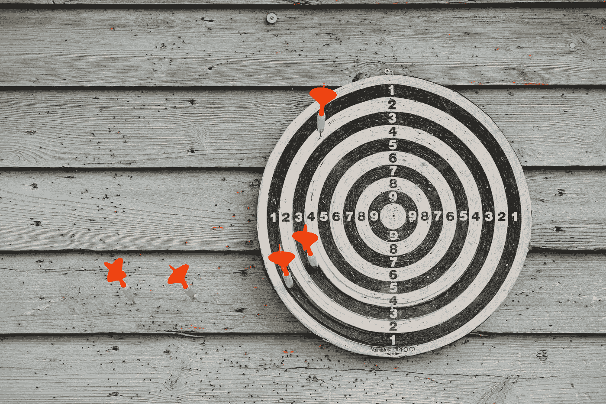
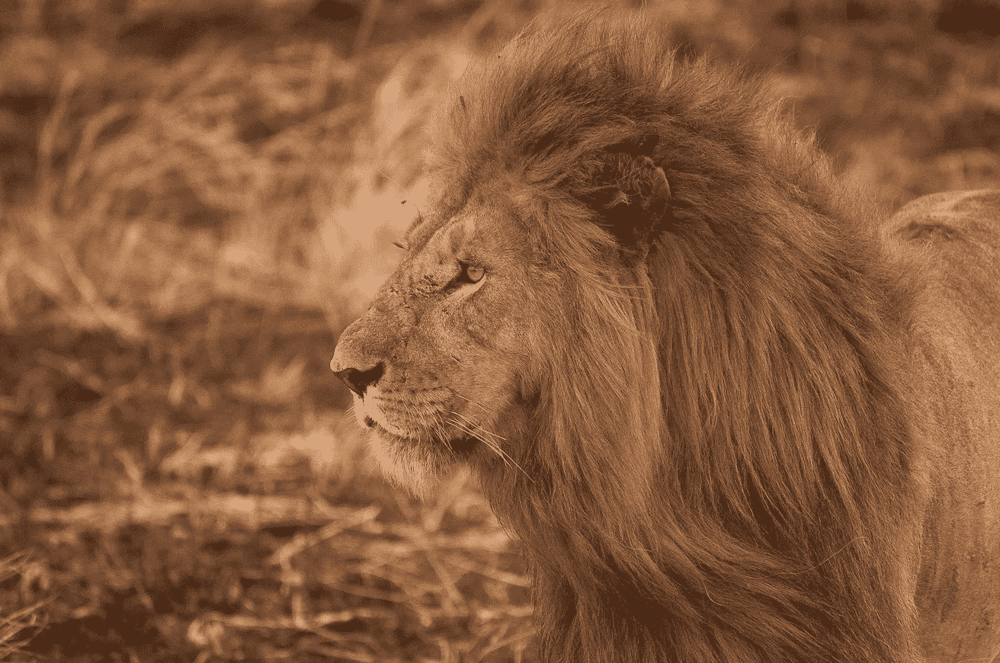

# 零射击学习深潜:如何选择一个和当今的挑战

> 原文：<https://pub.towardsai.net/zero-shot-learning-deep-dive-how-to-select-one-and-challenges-60ae243e040a?source=collection_archive---------1----------------------->

首先，我们必须在高层次上澄清零射击学习和深度学习之间的区别，因为我已经看到太多关于这两者的混淆:

来自 Unsplash 的 Miikka Luotio

# 零炮学习是在训练过程中获得的关于标记实例的知识。另一方面，深度学习是在评估阶段学习的关于未标记的训练实例的知识。

有了这两个，还有四个更详细:让我们进一步打开包装——这一次，**零射击学习、深度学习、无监督学习和监督学习** ( *所有这些都与即将出现的关于零射击学习的定义有关*):

**零镜头学习**将观察到的和未观察到的类别结合到一个共享空间中，在这里两者可以被一起观察和标记。分类的实现是通过学习一个联合嵌入空间来完成的，在这个空间中可以投射可见的和不可见的类别。

**深度学习**模型依靠预先训练的深度网络的深度网络来执行分类任务。这些网络是使用零触发学习框架来学习的，其中每个分类器是针对训练实例中不存在的类别的图像特征(使用图像作为类似的例子)来训练的。这个零起点的学习框架是一个强大的框架，但是没有被广泛使用。相反，我们将使用深度网络在其预训练状态期间已经学习的知识来执行分类任务。

**无监督学习**是通过对除训练实例之外的已标记类别的样本进行分类而获得的关于未标记类别的知识。分类过程使用深度网络在其预训练状态期间已经学习的知识。

在**监督学习**中，收集图像的特征，并训练分类器在给定观察到的类别的情况下预测它们。

来自 Unsplash 的 Tanner Boriack

# **零距离学习现代解说**

> *1。它检测图像中的一个对象或一组对象(仍然类似于图像示例),而无需查看它或查看它的任何属性(这称为零拍摄学习)。)坚持使用图像来进一步揭开谜团——相比之下，物体识别是一个零射击问题，每次看到物体的图像时，都需要以一种新的方式标记数据。这就是监督学习的用武之地。受监督的学习者观察世界并记录在图像、电影和其他方法中看到的物体的名称和图像，而不是用物体类别的标记实例来训练网络。通过结合这两种学习技术，我们可以在图像上训练零镜头学习模型，从而获得优于其他零镜头学习管道的优势，这些零镜头学习管道没有数据或专业知识(部署的团队)来对图像执行零镜头学习。*
> 
> *2。这是一个零射击学习范例，其中被标记的实例没有被训练来执行被标记的任务。相反，通过联合嵌入空间来学习任务，在该空间中，训练集和测试集都可以被投影用于最近邻搜索。*
> 
> *3。这是一个零镜头学习范例，其中标记实例的数量保持尽可能低。此外，我们可以在少量带标签的样本上训练一个深度网络，这将有助于它更有效地学习最近邻搜索。然而，另一方面，这也意味着训练实例的数量保持尽可能低，当样本数量很大时，这不是很有用。因此，可以决定标记样本的数量必须保持尽可能低。*
> 
> *4。神经网络是任何零射击学习项目的基本构建模块。它们由一组标记实例和一个学习算法组成，该学习算法学习一个联合嵌入空间，在该空间中可以投影标记和未观察的类别样本。*

零触发学习的最常见形式涉及在新类别的数据样本上训练零触发分类器，即训练集和测试集是不相交的。例如，每次获得该类别的唯一图像集合时，识别新的对象类别。在零投学习中，这叫做零投学习。然而，在实践中，大多数零射击学习项目使用具有预训练单词嵌入的深度网络作为训练实例。使用预先训练的单词嵌入作为训练实例的优点在于，它们在训练期间已经被视为类。因此，他们不需要重新接受新类别的培训。

然而，在测试期间，预训练的单词嵌入不被视为一个类别。只是给培训时没有观察到的班级贴了个标签。因此，它不如相应的未观察类别准确。另一方面，通过使用具有预先训练的单词嵌入的深度网络作为训练实例，零击学习的准确性显著提高。

来自 Unsplash 的 Sharon McCutcheon

# **零起点学习的持续挑战**

1.零触发学习的主要缺点是，在尚未处于训练状态的样本上训练和评估零触发学习模型是非常计算密集的(如果不是不可能的话)。

2.依赖于学习联合嵌入空间，在该空间中可以投影语义属性表示和语义词向量空间表示。例如，如果需要学习图像标题来表示新的对象类别，我们将需要在新的对象类别上训练图像标题模型，然后将该模型与语义模型已经学习的知识进行比较。另一方面，假设新类别不再出现在训练数据中。在这种情况下，可以得出结论，使得图像字幕模型需要学习该类别的新的语义属性表示。

3.在机器学习中，从文本描述中提取的单词嵌入通常相对于对象的类别来训练。这就是所谓的语义嵌入。在零镜头学习中，我们感兴趣的是获得对象类别的相应语义嵌入，而不是关于该类别训练的语义嵌入。同样，回到构建信息加载的基础管道所需的时间和大量资源。

**4。在没有实际看到的情况下，很难在一组数据中做出预测。**例如，如果我训练了一个预测给定物体类别的模型，但从未见过那种动物，我还能预测那个类别吗？是的，如果我有那个类的一些训练数据，我也有其他类别的一些训练数据。所以，下一次我看到兔子的图像时，我可以预测它是一只兔子。但是，如果我没有该类别的任何训练数据，我无法做出相同的预测。那么，如何才能解决这个问题呢？让我们考虑一个简单的例子，在以前从未见过物体的类型的情况下识别该物体的类别。假设我想要识别一种动物，但是我没有任何我想要识别的动物的照片。借助一些文字描述，我还能认出这种动物吗？是的，如果我对给定类别中常见的动物有所了解的话。如果我从未见过这种动物，我还能认出它吗？不，因为我没有足够的关于这个种类的知识，在没有关于这种动物的训练数据的情况下，我不能正确地识别它。我们能用深度网络解决这个问题吗？是的，我们可以。

来自 Unsplash 的 Amar Yashlaha

# **零距离学习很厉害**

在野外没有看到的情况下，我们如何学会区分两个相似的物体？事实上，我们可以做到这一点，每个类只有几百个标记的实例！每个类有几百个标记实例，学习识别不在训练实例中的对象仍然是可能的。

## 如何将学习构建成每类只有几百个标记实例的零命中率分类器？

例如，在学习每类只有 100 个标记实例的零命中率分类器的情况下。让我们假设我们想要识别照片中对象的类别，但是我们没有足够的训练数据来为每个类别训练零镜头分类器。我们还能通过仅仅 100 个标记的实例来识别类别吗？可能不会，因为我们没有相应的标记实例。另一方面，如果对于给定的类，我们有大量的标记实例，即使我们没有相应的标记实例，我们也可以为该类训练零命中率分类器。

这里有一个基于词向量的解决这个问题的途径。假设我们想要识别照片中对象的类别，但是我们没有足够的训练数据来为每个类别训练零镜头分类器。我们还能用向量这个词来识别类别吗？也许吧，但是因为我们没有相应的标记实例。另一方面，如果我们有大量给定类别的标记实例，即使我们没有相应的标记实例，我们也可以为该类别训练零命中率分类器。

在训练过程中，使用深度网络而不是学习二元一对一分类器的优势是什么？通过深度网络，我们可以利用大多数对象类别由多个子类别组成的事实。每一类都有自己对应的嵌入空间。这意味着我们可以为类别 A 训练零镜头分类器，将相应的类别图像嵌入到类别图像嵌入空间中。然后，在来自训练实例的知识的帮助下，我们可以从数据中识别出在类别图像嵌入空间中在类别图像嵌入左侧具有最近邻居的类别。因此，我们可以从没有这种最近邻的数据中预测类别。

# 使用深度网络实现零镜头分类的关键是在标记类别和相应的嵌入空间之间使用分隔符函数。

在零触发学习中，分隔符功能是一个包含训练和推理的两阶段过程。训练是关于所获得的标记样本集的知识；推论是扩展了以前获得的知识，并对产生的类别进行了标记。我们将使用单词 embedding space 作为一个可能的分隔符函数的例子。此外，我们还将使用特征空间作为可能的分隔符函数的示例。

作为一个例子，下面是我们如何使用单词嵌入空间作为分隔符函数来解决零镜头分类问题。在特征空间中没有对应的类别图像的情况下，我们如何识别图像中对象的类别？我们可以使用单词嵌入空间作为这类对象的占位符，并使用特征空间作为训练实例，在这类对象上训练零射击分类器。然后，我们可以将得到的标记实例与测试集中对应的类别图像进行比较，并使用标签嵌入作为肯定或否定标志来评估两个类别之间的匹配。当我们不确定正在学习检测的对象的身份时，我们通常希望使用零射击学习方法。例如，当我们想要识别图像中从未见过的对象的类别时，我们可以使用深度网络来学习类别之间的属性嵌入映射以及图像属于哪个类别。然后，我们可以使用这种映射将实例归类到不同的类别中。

当我们在训练时无法访问相应的类别时，我们还可以使用零镜头学习方法来解决分类问题。例如，我们可能从未见过图片 1 中的猫，但我们见过其他类别 1 和 2 中的猫，依此类推。同样，我们可能从未见过第一类中的猫，但见过马、斑马和蜥蜴。我们可以使用这三个类别之间的属性嵌入映射对这些对象进行分类。最后，我们可以将剩余的类别归类为没有对应的映射。因此，我们不知道这些物体属于哪一类。因此，我们可以使用零射击学习方法来识别测试集中的这些类别，而无需在这些类别中看到猫、马或斑马。

来自 Unsplash 的 Victoriano Izquierdo

# **如何选择零距离学习法**

你首先要明白的是，选择哪种类型的零投学习法:

1.基于实例的零镜头学习:这里的方法是在需要新的类别时，集中于对输入图像进行分类。举个例子，想象一下把熊猫的图像识别为熊猫，或者把鹰的图像识别为鹰。你可以学习将鹰的图像归类为鹰，但你没有数据或专业知识对鹰做同样的事情。因此，你必须依靠已经学到的关于鸟类的知识，通过分析你以前见过的鸟类的视觉样本。这些方法不是依赖于训练实例已知的知识，而是强调训练实例需要在评估阶段具有由训练模型捕获的相关知识。因此，在训练期间识别的类别被替换为对应于新类别的标记案例。这种零射击学习方法相对于其他方法的一个显著优点是，你不需要将在训练实例中已经学到的知识转移到测试阶段。因为您已经在案例的训练和测试集中执行了必要的分离，所以测试阶段只是正确获取和使用标记的实例的问题。

2.综合抽样:以研究项目为例。综合方法是基于这样的观察，即投入到任何研究项目中的大部分时间和精力被分配给开发新的想法，而很少或甚至没有时间或资源被分配给测试和验证操作。因此，在任何研究领域所取得的进展的很大一部分是由于几个具有献身精神的人的工作，他们不知道任何先前的工作正在进行。例如，想象一下在业余时间开发一种新的药物发现技术。验证发现准确性的唯一方法是使用现有的药物发现方案进行 I/II 期临床试验。由于其他资源很少，你学习新事物的机会很少。因此，您开发了一种新的机制，以预测未来测试实例结果的方式组合两种或更多种不同类型的数据(例如，图像和文本)。

在另一个例子中，您可以将可视注释与文本描述相结合来描述新识别的动物物种。由于科学以前不知道这个新物种，你假设它是一个新的动物种类，你进行了第一次临床试验来证明这一点。随后，你引入了文本描述中不存在的未知物种的新特征，并可以解释它在新类别中的发现。您还将执行第二次临床试验，结合新类型的文本描述来测试这个新特性。之后，在对比两类样本时，可以利用前两次试验已经学到的知识来预测第三次试验的结果。其结果是，你刚刚在科学文献中引入了该对象的一个新颖范畴，这是前所未见的。你可以利用这些知识来进一步识别、分类和进一步分类以前没有见过的其他类别的物体。目标是构建一个类别间和类别内预测相关性最高的小说类别目录。因此，合成方法的思想是将视觉、文本和非语言元素组合成复合图像文件，该复合图像文件然后可以被馈送到 CNN 学习框架中，在该框架中，每个类名将被学习为单独的嵌入空间。网络将学习识别不在合成图像文件中但在文本描述和图像中找到的所有类别。

这可以参考一个全面介绍与实证研究:[https://arxiv.org/pdf/1707.00600.pdf](https://arxiv.org/pdf/1707.00600.pdf)